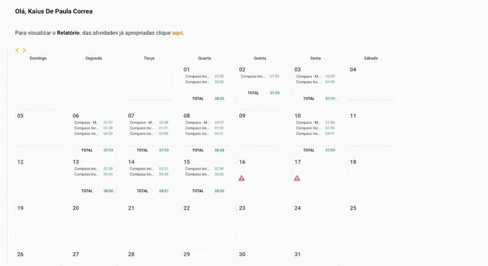

# Needle Timesheet

> Your timesheet is already filled. You just haven't told Needle yet.

Clicking through dropdowns to allocate 8 hours across 3 projects, once a day, every day. The data's already there. Your punches, your projects, your tasks. Needle Timesheet reads what Needle already knows, asks you *how much time goes where*, and submits.

## Before / after

**Before:** log into Needle → click the day with a red icon → for each period, click "add appropriation" → search the project dropdown → search the task dropdown → type start/end times → type "Atividades Gerais" → if in multiple projects, add a new period split, add end time on last project and begin time on second, plus a minute  → repeat. Miscount a appropriation you'll need to exclude it all and do it all again.

**After:** `needle` → arrow keys to pick a day → type how many hours per project → enter. Done.

## How it works

1. Reads your **Firefox** cookies to authenticate with Needle (you must be logged in).
2. Fetches your clock-in/out periods for the day. The punches are already there.
3. Asks how many minutes/hours go to each project. Type `r` on one to dump the remainder.
4. Schedules the allocations across your periods. Asks for a task per project (arrow keys again).
5. Preview, confirm, submit.

That's it. No dropdowns, no searching, no "Atividade..." typing 4 times.

> If you are using firefox from the Microsoft Store, this tool won't work. Please install it from the official firefox installer and log into needle.

It's that simple! Take a look:



## Install

Grab the `.whl` file, located in the `releases` tab in this repository page, open a terminal at the `Downloads` folder and:

```bash
pipx install needletimesheet-0.1.0-py3-none-any.whl
```

On **Windows**, pip works directly:

```bash
pip install needletimesheet-0.1.0-py3-none-any.whl
```
**Windows users:** Please note that you may need to add your scripts folder into PATH. Pip will warn you of that.

To upgrade later:

```bash
pipx uninstall needletimesheet
pipx install needletimesheet-0.2.0-py3-none-any.whl
```

Or from source:

```bash
git clone https://github.com/kaiusdepaula/NeedleTimeSheet
cd NeedleTimesheet
uv sync
uv run needle
```

Requires Python ≥ 3.12. Reads cookies from **Firefox** or **Chrome**. Log into Needle in one of them first.

## Usage

```bash
needle
```

Arrow keys to pick a day, type allocations, confirm. That's the happy path.

```bash
needle --lazy
```

**Skips the task picker. (My favorite argument)** Automatically selects "Atividade Geral" for every project. Falls back to the picker if it can't find one.

```bash
needle --debug
```

Prints the HTTP request payload before submitting. Good for "is this really what I'm about to send?"

### Duration formats

When asked how much time to allocate, any of these work:

| Input | Means |
|-------|-------|
| `1.5` | 1h30m |
| `90` | 1h30m |
| `1:30` | 1h30m |
| `1h30m` | 1h30m |
| `90m` | 1h30m |
| `r` | dump all remaining minutes here |
